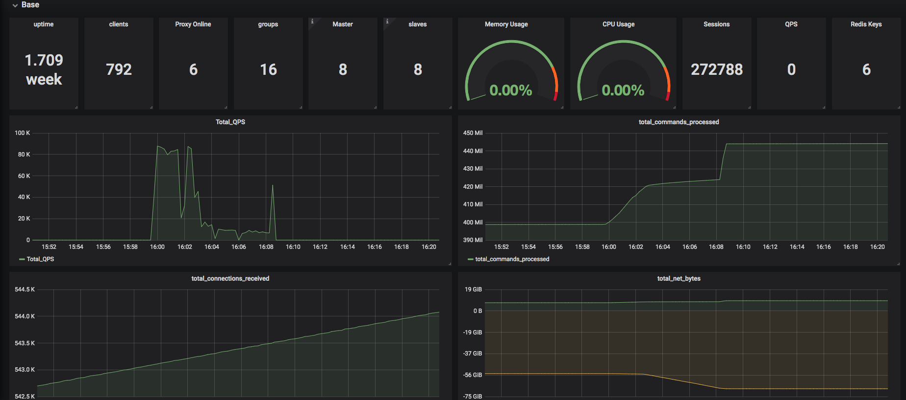
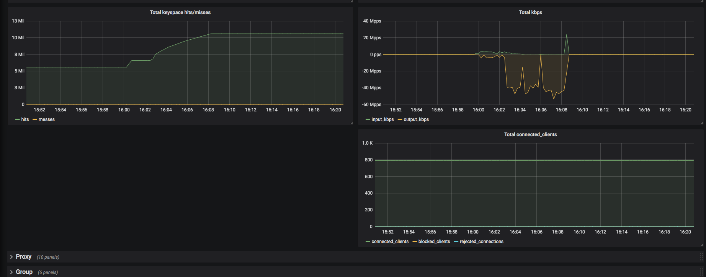

<!--
 * @Descripttion: 
 * @version: xv1.0
 * @Author: changwei5
 * @Date: 2019-04-24 16:57:49
 * @LastEditors: changwei5
 * @LastEditTime: 2021-06-11 14:06:24
-->

# Codis Metrics Exporter

```

Prometheus exporter for Codis metrics.<br>
Supports Codis 3.2.2


```

##  grafana screenshot 







Grafana dashboard is available on [github.com](contrib/grafana_prometheus_codis_dashboard.json).


## Building, configuring, and running

Locally build and run it:

```
    $ go mod tidy
    $ go mod vendor
    $ go build
    $ ./codis_status_exporter <flags>

    OR
    
    $ go mod tidy
    $ go mod vendor
    $ make linux
    $ ./codis_status_exporter <flags>
```


Add a block to the `scrape_configs` of your prometheus.yml config file:

```
scrape_configs:

...

- job_name: codis_exporter
  static_configs:
  - targets: ['localhost:8082']

...
```